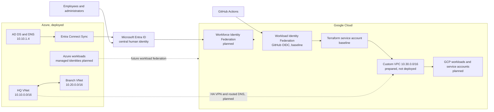

# Multi-Cloud Hybrid Identity and Infrastructure

This repository extends an existing Azure-hosted Active Directory and Microsoft
Entra ID environment into Google Cloud. It treats identity, network connectivity,
automation and cost control as one operating model instead of building an isolated
second cloud.

The business scenario is an organisation that already depends on traditional
enterprise Active Directory patterns but hosts that environment in Azure. The
organisation wants to adopt GCP while keeping Entra ID as the central identity
provider for people, using cloud-native identities for workloads, and avoiding
long-lived credentials in automation.

The existing Azure implementation remains in the separate
[two-site hybrid identity repository](https://github.com/sindredg/two-site-hybrid-identity-).
This repository documents the cross-cloud architecture and owns the new GCP
foundation. It does not duplicate the Azure implementation.

## Business goals

- Give employees one Entra-backed sign-in path into Azure and GCP.
- Give workloads platform-native identities instead of human credentials.
- Connect the clouds through controlled, routed connectivity when the baseline is
  approved.
- Make infrastructure repeatable, reviewable and recoverable with Terraform.
- Put budget alerts and lifecycle controls in place before paid workloads.
- Create a measured path toward containers and modernised workload placement.

## Current and planned state

| Capability | Status | Notes |
|---|---|---|
| Azure-hosted AD DS and DNS | Deployed, documented in the Azure repository | HQ is in Sweden Central. |
| Entra Connect and hybrid identity | Deployed, documented in the Azure repository | Entra ID is the central identity system. |
| Azure branch site | Deployed, documented in the Azure repository | Denmark East is connected to HQ by Azure VNet peering. |
| GCP cost, state and automation foundation | Deployed | Budget, protected state bucket, Terraform service account and GitHub OIDC trust were created from a reviewed plan. |
| GCP custom VPC and initial subnet | Terraform prepared, not deployed | `10.30.0.0/16`, starting with `10.30.1.0/24`. |
| Entra Workforce Identity Federation | Proposed | Human sign-in to GCP. |
| Azure-to-GCP HA VPN | Proposed | No VPN resources are in the baseline. |
| Compute, containers, backup and recovery | Proposed | Workload decisions follow foundation review. |

## Architecture overview



Azure VNet peering connects the two Azure sites. It is not the proposed
cross-cloud connection. The later Azure-to-GCP design uses site-to-site VPN,
explicit routes and an approved DNS forwarding model.

## Identity and security boundaries

Human access and automation use separate trust paths:

- Entra Workforce Identity Federation is for people and remains a proposed phase.
- GitHub Workload Identity Federation is for CI. GitHub exchanges an OIDC token
  for short-lived GCP credentials and impersonates one Terraform service account.
- GCP workloads use attached service accounts. Azure workloads use managed
  identities. Neither path uses employee accounts or downloaded service account
  keys.
- The initial GCP network has no broad ingress rule. GCP's implied deny-ingress
  behaviour remains in effect until specific workloads and VPN flows are approved.

## First foundation milestone

The deployed bootstrap foundation contains:

1. A NOK 1,000 monthly budget with 50%, 75% and 90% actual-spend alerts.
2. A protected, versioned GCS Terraform-state bucket.
3. A least-privilege Terraform service account and repository-restricted GitHub
   OIDC trust.

The custom-mode VPC and `europe-north1` subnet are implemented as reviewed
Terraform but have not been applied. They are the next infrastructure phase, not a
deployed foundation resource.

It does not create compute, Cloud NAT, HA VPN, GKE, load balancers, managed
firewalls or other paid always-on workload services. Budget alerts notify; they do
not cap or automatically stop spending.

## Repository layout

```text
docs/                         Architecture evidence, operations and ADRs
terraform/bootstrap/          One-time GCP state, budget and identity foundation
terraform/modules/            Focused reusable GCP modules
terraform/environments/dev/   Thin development network root
```

Read the [foundation deployment record](docs/00-gcp-foundation.md) and
[foundation runbook](docs/foundation-runbook.md). Detailed
[GCP](docs/architecture/gcp.md) and
[end-to-end hybrid](docs/architecture/hybrid.md) architecture views explain the
security and control-plane boundaries. The
[troubleshooting log](docs/troubleshooting/README.md) records encountered issues
and safe first responses for future failures. The Azure evidence
and constraints are recorded in
[existing-azure-environment.md](docs/existing-azure-environment.md). Major choices
are tracked in [ADRs](docs/adr/README.md).

## Cost and cleanup

The empty VPC and subnet do not introduce an always-on compute charge. The state
bucket has small storage and operation costs. Object lifecycle management removes
noncurrent state versions after 30 days. Advanced firewall inspection and flow logs
are excluded from the baseline.

Destroy the dev root before bootstrap resources. The state bucket uses
`force_destroy = false`, so normal Terraform destroy cannot silently erase state.
Deleting versioned state requires a separate, explicit recovery-impact decision.

## Limitations and validation status

The bootstrap foundation has been applied to GCP. The custom VPC and subnet have not
been deployed. Repository checks validate formatting, configuration and address
policy, but they cannot prove live Azure health, Entra configuration, budget email
delivery or cloud connectivity. Those claims require authenticated validation and
recorded evidence.
