# GCP foundation

The first GCP phase established the controls needed before workload deployment.
It created the remote-state storage, cost budget, keyless Terraform identity and
GitHub trust boundary. It did not create compute, VPN, NAT, GKE or application
resources.

For the component relationships and trust boundaries, see the detailed
[GCP architecture](architecture/gcp.md). Encountered issues and safe diagnostic
steps are recorded in the
[Phase 0 troubleshooting log](troubleshooting/00-gcp-foundation.md).

## Outcome

Terraform created 17 foundation resources with no changes or deletions during the
initial apply. The resources consist of required service APIs, one protected state
bucket, one project budget, one Terraform service account and the GitHub Workload
Identity Federation configuration.

The bootstrap configuration also passed its mocked policy test before deployment.
The test checks state-bucket public access prevention and deletion protection
without contacting GCP.

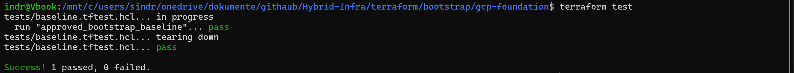

## Security boundaries

- The state bucket enforces public access prevention and uniform bucket-level IAM.
- Object versioning and noncurrent-version lifecycle management protect state
  recovery without retaining every generation indefinitely.
- Routine destroy cannot empty the state bucket because `force_destroy` is false.
- GitHub receives no service account key. Its OIDC token must name the approved
  repository and protected `gcp-dev` environment.
- The Terraform service account has network administration for the development
  project and object administration only on the state bucket.
- Human Workforce Identity Federation from Entra ID is a later phase and remains
  separate from this automation trust.

The Console verification shows that the state bucket is not public and uses uniform
bucket-level access. Operational identifiers are removed from the published
evidence while the controls themselves remain visible.

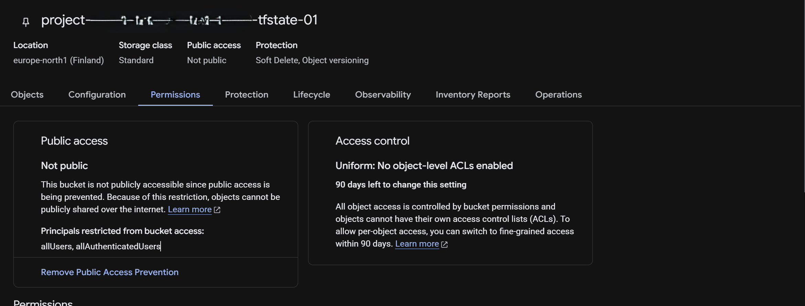

The Terraform automation identity is enabled without a user-managed service-account
key. Its project role is limited to Compute Network Admin for the planned network
phase rather than broad Owner or Editor access.

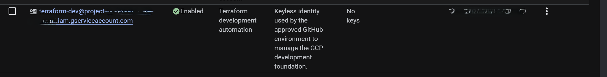

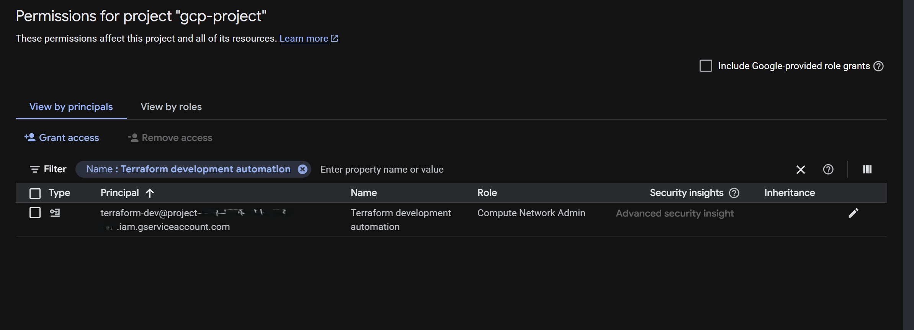

The deployed Workload Identity Federation pool contains the GitHub OIDC provider,
and the repository has the required `gcp-dev` deployment environment.

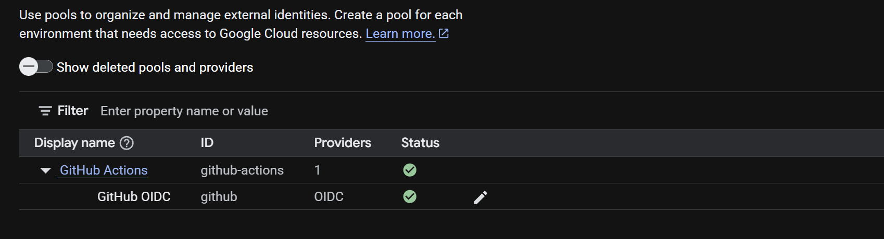

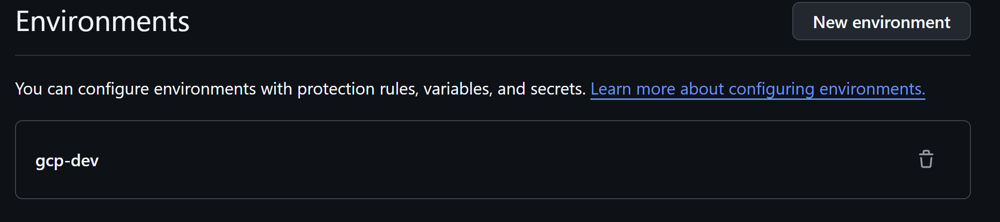

## Cost boundary

The monthly budget is NOK 1,000 with actual-spend alerts at 50, 75 and 90 percent.
The budget measures usage before promotional credits so that trial credits do not
hide the normal cost of experiments. A budget provides notification, not automatic
shutdown or a hard spending cap.

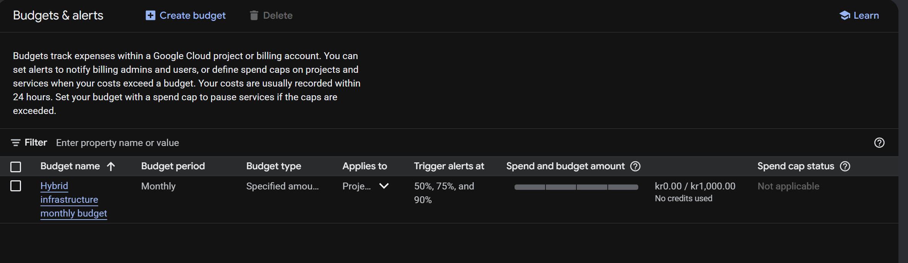

The foundation has no compute or managed connectivity. Its direct cost is limited
primarily to the small amount of GCS storage and operations used by Terraform state.

## Remote state and validation

After the initial apply, bootstrap state was backed up locally with owner-only
permissions and migrated from the local backend to the protected GCS backend. The
state object now exists under the `bootstrap/gcp-foundation` prefix.

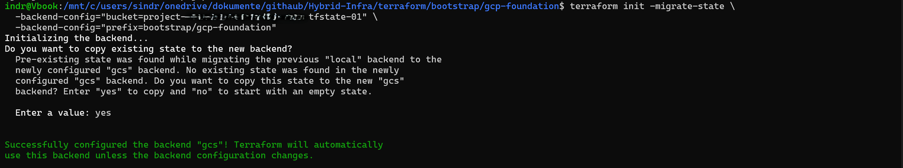

After migration, `terraform state list` read all 17 foundation resources through
the remote backend, including APIs, the bucket, budget, automation identity, IAM
bindings, workload identity pool and OIDC provider.

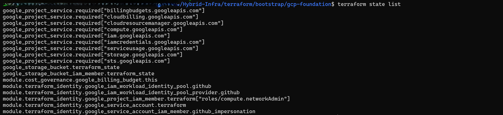

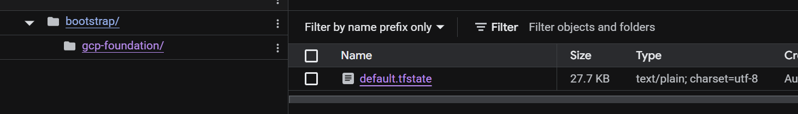

Object versioning is enabled, and a lifecycle rule deletes noncurrent generations
after 30 days. This provides a bounded recovery window for accidental overwrites.

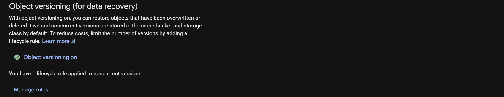

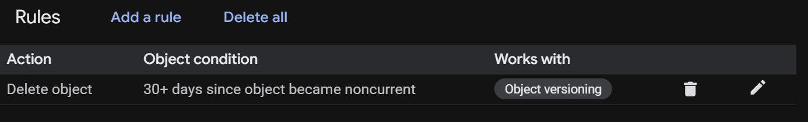

One post-apply plan exposed a no-op difference in the optional budget notification
block. Google omits the empty block when returning the budget, while Terraform
configuration requested it explicitly. This did not affect the thresholds or
deployed resources. Omitting the empty block resolved the drift; the final refreshed
plan reported no changes.

