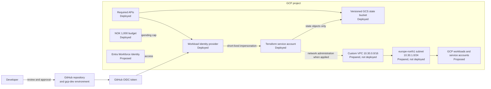
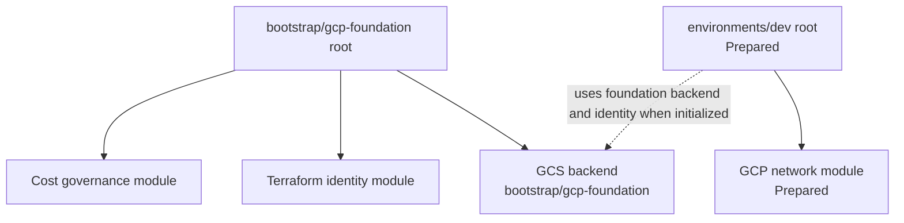

# Google Cloud architecture

This view describes the GCP side of the project. It distinguishes the deployed
foundation from the prepared development network and later identity, connectivity
and workload phases.

## Design intent

The GCP project is an extension of an existing Microsoft identity environment, not
a standalone identity silo. The first milestone establishes recoverable Terraform
state, cost visibility and keyless automation before introducing workloads or
always-on network services.

## Component status

| Layer | Component | Status | Responsibility |
|---|---|---|---|
| Project | Required Google APIs | Deployed | Enables billing budgets, IAM, STS, storage and later Compute networking |
| State | Regional GCS bucket | Deployed | Remote Terraform state with uniform access, public-access prevention, versioning and 30-day noncurrent-version retention |
| Cost | NOK 1,000 monthly budget | Deployed | Alerts at 50%, 75% and 90% of actual spend before promotional credits |
| Automation | Terraform service account | Deployed | Holds the project network role and state-object access needed by Terraform |
| Federation | GitHub Workload Identity pool and provider | Deployed | Exchanges approved GitHub OIDC claims for short-lived GCP credentials without a service-account key |
| Network | Custom-mode VPC, `10.30.0.0/16` reservation | Prepared | Provides a non-overlapping GCP address domain |
| Network | `10.30.1.0/24` subnet in `europe-north1` | Prepared | First workload subnet with Private Google Access and no broad ingress rule |
| Human identity | Entra Workforce Identity Federation | Proposed | Authenticates people with Entra while GCP IAM remains the authorization system |
| Connectivity | HA VPN, Cloud Router, routes and DNS forwarding | Proposed | Connects approved Azure and GCP prefixes without public workload exposure |
| Workloads | Compute, GKE and application service accounts | Proposed | Introduced only after identity, network, cost and lifecycle requirements are approved |

## GCP foundation flow

## Trust boundaries

### Human access

The proposed human path is Entra ID to GCP Workforce Identity Federation. Entra
authenticates the person; mapped attributes and GCP IAM decide what that person can
do. This is separate from GitHub automation and is not deployed in Phase 0.

### Terraform automation

The deployed workload provider trusts GitHub's token issuer only when the OIDC
claims identify the approved public repository and `gcp-dev` environment. A second
IAM condition controls which federated principal may impersonate the Terraform
service account. No downloaded GCP service-account key is used.

The service account can manage Compute networking in the project and state objects
in the dedicated bucket. It is not an Owner, Editor, Billing Administrator or
Project IAM Administrator.

### Application workloads

Future GCP applications receive their own attached service accounts. They must not
reuse the Terraform identity or a human Workforce identity. Their IAM roles and
network flows will be scoped to the workload introduced in that phase.

## Terraform and state lifecycle

The bootstrap root created resources that later roots depend on: the state bucket,
budget and automation identity. Its state was initially local because the bucket
did not yet exist, then migrated to the GCS backend under
`bootstrap/gcp-foundation`.

The development root is intentionally thin. It calls the reusable `gcp-network`
module and supplies environment-specific names, region and CIDRs. Its backend
configuration remains local and ignored until the root is deliberately initialized
against the state bucket.

## Network design

`10.30.0.0/16` is reserved for GCP and does not overlap the Azure HQ
`10.10.0.0/16` or branch `10.20.0.0/16` networks. The first prepared subnet is
`10.30.1.0/24` in `europe-north1`.

The VPC is custom mode. No automatic regional subnets are created. Private Google
Access is enabled on the prepared subnet, while flow logs are disabled initially to
avoid unnecessary cost and data collection. No firewall rule, Cloud NAT, external
load balancer, compute instance, GKE cluster, VPN gateway or Cloud Router is part of
the deployed baseline.

## Recovery and failure boundaries

- State-bucket public access prevention and uniform bucket-level IAM reduce the
  chance of accidental exposure.
- Object versioning provides recovery from overwrite or deletion; lifecycle policy
  removes noncurrent generations after 30 days.
- `force_destroy = false` prevents a normal destroy from silently emptying the
  state bucket.
- The local pre-migration state backup remains outside the repository.
- The budget warns about spend but does not stop resources or guarantee immediate
  delivery.

## Validation boundary

Phase 0 evidence proves the foundation apply, remote-state migration, keyless
service account, project role, federation objects, budget configuration and final
no-change plan. It does not prove a GitHub deployment workflow, Entra Workforce
sign-in, VPC deployment, cross-cloud routing, DNS forwarding or application access.
