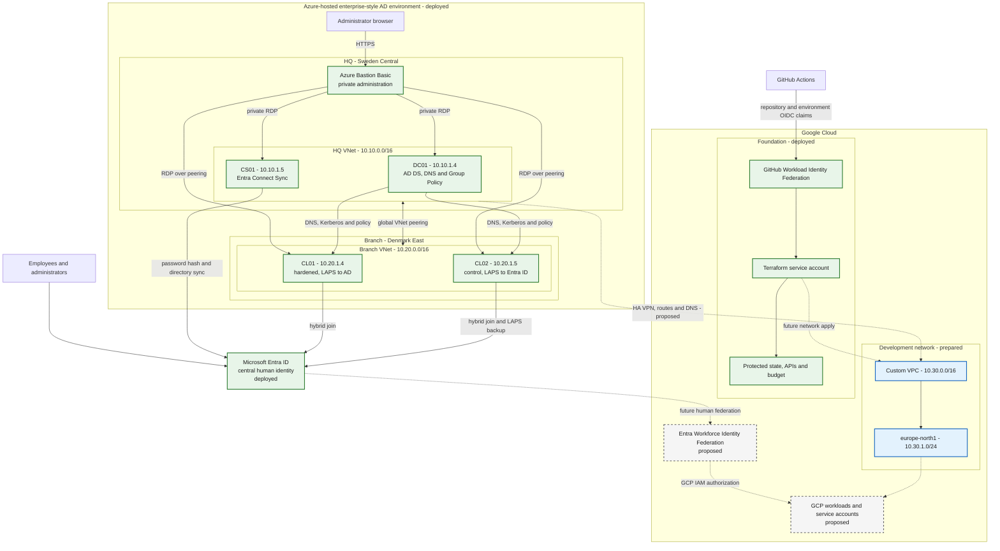

# End-to-end hybrid architecture

This view joins the existing Azure-hosted Active Directory environment, Microsoft
Entra ID and the GCP foundation into one operating model. Azure hosts the Windows
directory servers; it is not described as a physically on-premises environment.

## Architecture status

The Microsoft side is documented in the separate
[two-site hybrid identity repository](https://github.com/sindredg/two-site-hybrid-identity-).
The facts used here are summarized in
[existing-azure-environment.md](../existing-azure-environment.md). Live health and
configuration should be revalidated before implementing cross-cloud connectivity.

## Identity planes

### Active Directory Domain Services

DC01 is a Windows Server domain controller and DNS server hosted on an Azure VM.
AD DS remains authoritative for the Windows domain, Kerberos, LDAP, Group Policy
and domain-joined computer relationships. Azure is the hosting location; AD DS is
not Microsoft Entra ID and is not the Azure AD Domain Services managed product.

### Microsoft Entra ID

CS01 runs Entra Connect Sync and synchronizes selected directory identities and
devices into Entra ID. Entra is the central human identity provider for cloud
access. The existing environment uses password-hash synchronization and hybrid
Entra join within the capabilities of the free tenant.

For the proposed GCP human-access path, Entra proves authentication and supplies
claims. GCP Workforce Identity Federation maps those claims, while GCP IAM grants
roles. Central identity therefore does not mean central authorization: each cloud
still owns permissions to its resources.

### Automation and workloads

GitHub automation does not sign in as a person. GitHub OIDC exchanges a
repository-and-environment-bound token through GCP Workload Identity Federation and
impersonates the Terraform service account for a short period.

Future applications use cloud-native identities: managed identities in Azure and
service accounts in GCP. Human identities, Terraform automation and application
workloads remain three separate security boundaries.

## Network and DNS planes

The two Azure VNets are connected by global VNet peering. That connection does not
extend into GCP. The proposed cross-cloud design requires an Azure VPN gateway,
GCP HA VPN, Cloud Router/BGP or deliberately managed static routes, explicit
firewall rules and a DNS forwarding design.

| Address domain | CIDR | Status |
|---|---|---|
| Azure HQ | `10.10.0.0/16` | Deployed |
| Azure branch | `10.20.0.0/16` | Deployed |
| GCP reservation | `10.30.0.0/16` | Prepared |
| First GCP subnet | `10.30.1.0/24` | Prepared |

Domain-dependent GCP workloads would need routes to DC01 and a controlled DNS path
to the AD DNS service. Connectivity alone is insufficient: DNS forwarding,
firewall ports, failure behavior and the security impact of extending the Windows
trust boundary must be approved together.

## Control-plane ownership

| Concern | Authoritative system |
|---|---|
| Windows domain identities, Kerberos and Group Policy | AD DS on DC01 |
| Cloud human authentication | Microsoft Entra ID |
| Azure resource authorization | Azure RBAC |
| GCP resource authorization | GCP IAM |
| GitHub automation claims | GitHub OIDC |
| Terraform state | Protected GCS backend |
| Azure infrastructure implementation | Separate Azure repository |
| GCP foundation and cross-cloud design | This repository |

## Failure and recovery boundaries

- If DC01 is unavailable, domain DNS, Kerberos and AD-dependent operations fail;
  Entra password-hash authentication can continue independently.
- If Entra is unavailable, new federated human sign-ins to GCP cannot complete;
  existing cloud sessions depend on their token lifetime.
- If GitHub federation fails, Terraform automation stops without affecting running
  infrastructure.
- If the future VPN fails, cloud-local workloads continue, but cross-cloud AD, DNS
  or application flows fail according to their dependencies.
- GCS object generations protect Terraform state history, but they are not an
  application-data backup strategy.

## Deliberately unresolved design work

- Entra tenant, group and claim mappings for GCP Workforce Identity Federation
- GCP organization-level Workforce pool configuration and IAM role design
- VPN SKU, availability, BGP ASN selection, route advertisement and failover tests
- DNS forwarding direction, resolver placement, caching and outage behavior
- First workload ports, service accounts, recovery objectives and lifecycle controls
- Whether later container modernization uses GKE or another managed runtime
